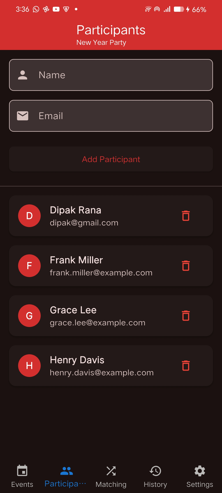
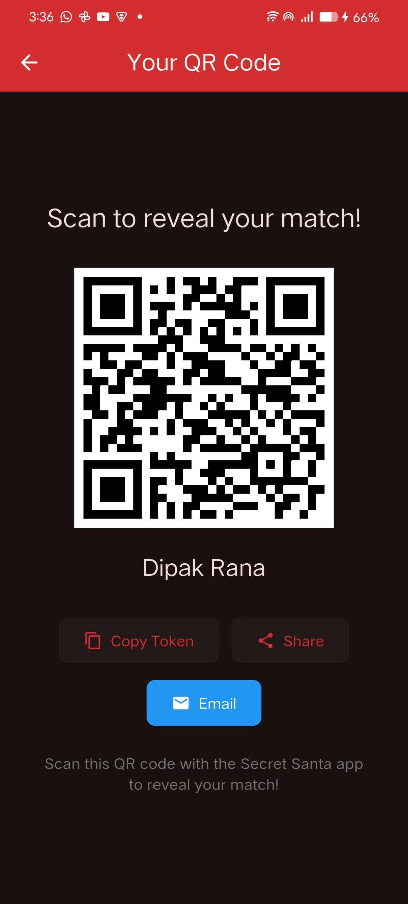
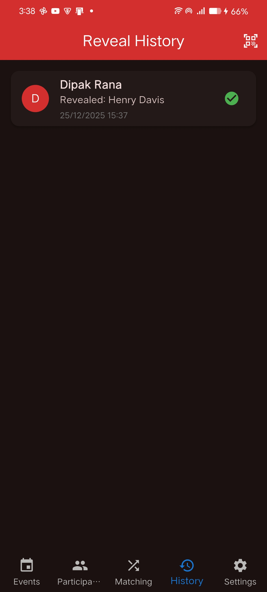
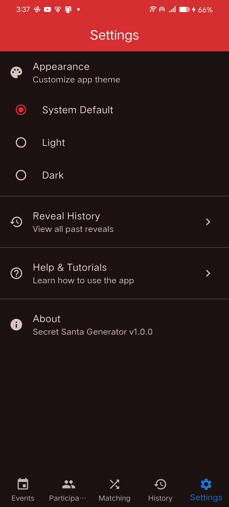
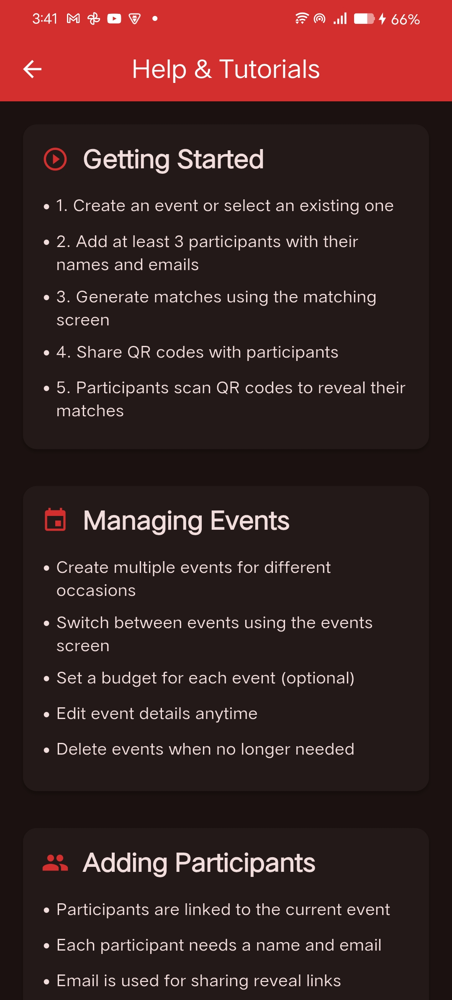

# 🎁 Secret Santa Generator


A Flutter-based Secret Santa application that automates participant management, secure pairing generation, and anonymous reveal mechanisms. Built with Clean Architecture principles and Riverpod for state management.

## ✨ Features

- 🎯 **Multiple Events Management** - Create and manage multiple Secret Santa events with budgets and dates
- 👥 **Participant Management** - Add/remove participants with automatic validation
- 🎲 **Smart Matching Algorithm** - Automatic pair generation ensuring fair distribution (no self-matching)
- 🔐 **Anonymous Reveal System** - Generate unique QR codes and shareable links for secure reveals
- 📊 **Reveal History** - Track all reveals in one place
- 🎨 **Beautiful UI** - Festive animations, dark mode support, and smooth transitions
- 🔒 **Privacy First** - All data stored locally on your device (100% offline)

## 📸 Screenshots

> 📱 Screenshots shown are from **Android** and **iOS** platforms.

<table>
<tr>
<td align="center" width="33.33%">
<strong>Events Management</strong><br><br>

</td>
<td align="center" width="33.33%">
<strong>Participant Management</strong><br><br>

</td>
<td align="center" width="33.33%">
<strong>Matching</strong><br><br>

</td>
</tr>
<tr>
<td align="center" width="33.33%">
<strong>QR Code Generation</strong><br><br>

</td>
<td align="center" width="33.33%">
<strong>Reveal</strong><br><br>

</td>
<td align="center" width="33.33%">
<strong>Reveal History</strong><br><br>

</td>
</tr>
<tr>
<td align="center" width="33.33%">
<strong>Settings</strong><br><br>

</td>
<td align="center" width="33.33%">
<strong>Help</strong><br><br>

</td>
<td align="center" width="33.33%">
</td>
</tr>
</table>

## 🛠️ Tech Stack

- **Framework**: Flutter 3.38.5+
- **Language**: Dart 3.10.4+
- **State Management**: Riverpod 3.0+ (with code generation)
- **Architecture**: Clean Architecture (3 layers: Presentation, Domain, Data)
- **Local Storage**: Hive
- **Navigation**: go_router
- **Code Generation**: Freezed, Riverpod Generator, JSON Serializable
- **Functional Programming**: dartz (Either for error handling)

## 📐 Architecture

This project follows **Clean Architecture** principles with strict layer separation:

```
Presentation → Domain ← Data
```

### Layer Structure

- **Domain Layer**: Pure business logic, entities, use cases, repository interfaces (no Flutter dependencies)
- **Data Layer**: Repository implementations, data sources (Hive), models with JSON serialization
- **Presentation Layer**: UI components, Riverpod providers, screens, widgets

### Project Structure

```
lib/
├── core/
│   ├── constants/      # App-wide constants
│   ├── error/          # Failure classes
│   ├── theme/          # App theme configuration
│   ├── utils/          # Utility functions
│   └── router/         # Navigation configuration
├── features/
│   └── [feature_name]/
│       ├── data/        # Data layer implementation
│       ├── domain/      # Business logic
│       └── presentation/ # UI layer
└── main.dart
```

## 🚀 Getting Started

### Prerequisites

- Flutter SDK 3.38.5 or higher
- Dart SDK 3.10.4 or higher
- Android Studio / VS Code with Flutter extensions
- For iOS: macOS with Xcode

### Installation

1. **Clone the repository**

   ```bash
   git clone https://github.com/YOUR_USERNAME/santa_flow_app.git
   cd santa_flow_app
   ```

2. **Get dependencies**

   ```bash
   flutter pub get
   ```

3. **Run code generation**

   ```bash
   dart run build_runner build --delete-conflicting-outputs
   ```

4. **Run the app**

   ```bash
   flutter run
   ```

## 📱 Running the App

### Development

```bash
# Run on connected device/emulator
flutter run

# Run on specific platform
flutter run -d android     # Android
flutter run -d ios         # iOS
```

### Build

```bash
# Android APK
flutter build apk --release

# Android App Bundle (for Play Store)
flutter build appbundle --release

# iOS (requires macOS)
flutter build ios --release
```

## 🧪 Testing

```bash
# Run all tests
flutter test

# Run tests with coverage
flutter test --coverage

# Run specific test file
flutter test test/features/participants/domain/usecases/add_participant_test.dart
```

## 🔧 Development Commands

### Code Generation

After modifying Freezed models or Riverpod providers:

```bash
# One-time generation
dart run build_runner build --delete-conflicting-outputs

# Watch mode (auto-regenerate on file changes)
dart run build_runner watch --delete-conflicting-outputs
```

### Code Quality

```bash
# Analyze code
flutter analyze

# Format code
dart format .

# Check formatting
dart format --set-exit-if-changed .
```

### Clean Build

```bash
# Clean build artifacts
flutter clean

# Get dependencies and regenerate
flutter pub get
dart run build_runner build --delete-conflicting-outputs
```

## 📦 Key Dependencies

### State Management

- `flutter_riverpod` - State management
- `riverpod_annotation` - Code generation for providers
- `riverpod_generator` - Code generator

### Data & Serialization

- `freezed` - Immutable data classes
- `json_annotation` - JSON serialization
- `hive` - Local NoSQL database
- `hive_flutter` - Hive Flutter integration

### Navigation & UI

- `go_router` - Declarative routing
- `animate_do` - Animations
- `lottie` - Lottie animations
- `confetti` - Confetti effects

### Features

- `qr_flutter` - QR code generation
- `mobile_scanner` - QR code scanning
- `share_plus` - Share functionality
- `uuid` - Unique ID generation

### Functional Programming

- `dartz` - Functional programming (Either for error handling)
- `equatable` - Value equality

## 🏗️ Architecture Patterns

### Use Case Pattern

Each use case follows a single responsibility:

```dart
class GetParticipants {
  final ParticipantRepository repository;
  
  GetParticipants(this.repository);
  
  Future<Either<Failure, List<Participant>>> call() {
    return repository.getParticipants();
  }
}
```

### Error Handling

All repository methods return `Either<Failure, T>`:

```dart
Future<Either<Failure, List<Participant>>> getParticipants();
```

### Riverpod Provider Pattern

Using code generation:

```dart
@riverpod
Future<List<Participant>> participants(ParticipantsRef ref) async {
  final repository = ref.watch(participantRepositoryProvider);
  final result = await repository.getParticipants();
  
  return result.fold(
    (failure) => throw Exception(failure.message),
    (data) => data,
  );
}
```

## 🤝 Contributing

1. Fork the repository
2. Create a feature branch (`git checkout -b feature/amazing-feature`)
3. Commit your changes (`git commit -m 'feat: add amazing feature'`)
4. Push to the branch (`git push origin feature/amazing-feature`)
5. Open a Pull Request

### Commit Convention

Follow [Conventional Commits](https://www.conventionalcommits.org/):

- `feat`: New feature
- `fix`: Bug fix
- `docs`: Documentation changes
- `style`: Code style changes
- `refactor`: Code refactoring
- `test`: Adding or updating tests
- `chore`: Maintenance tasks

## 📄 License

This project is private and not licensed for public use.

## 🔗 Resources

- [Flutter Documentation](https://docs.flutter.dev/)
- [Riverpod Documentation](https://riverpod.dev/)
- [Clean Architecture Guide](https://blog.cleancoder.com/uncle-bob/2012/08/13/the-clean-architecture.html)
- [Freezed Documentation](https://pub.dev/packages/freezed)

## 📝 Notes

- This is a learning project designed to progress from fresher to advanced level
- All data is stored locally - no cloud sync
- The app works 100% offline
- Minimum 3 participants required for matching

---

**Note**: Update the CI badge URL in line 3 with your GitHub username after pushing to GitHub.
